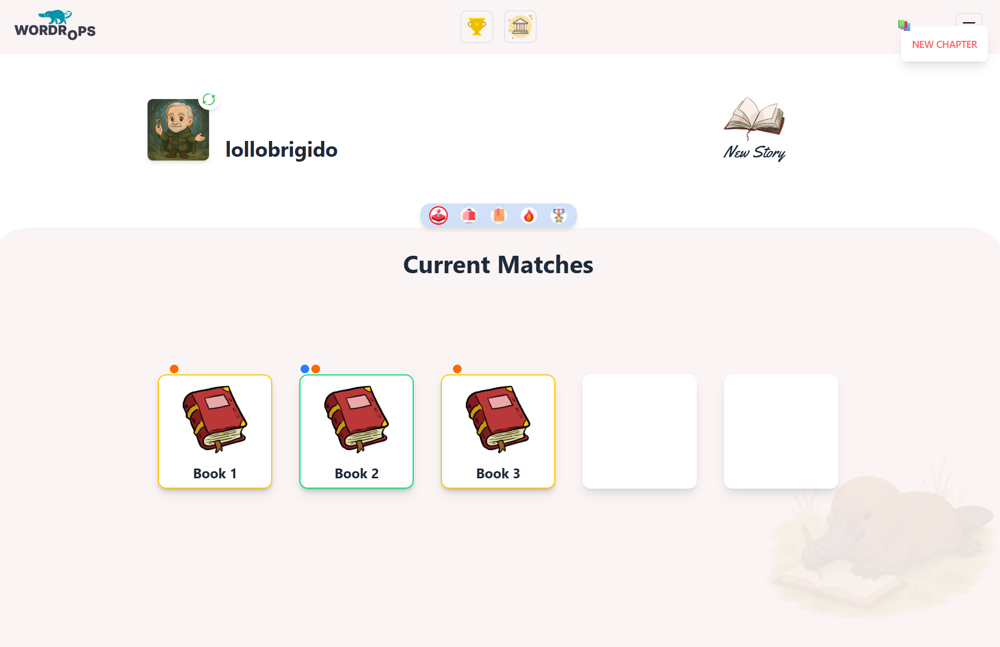
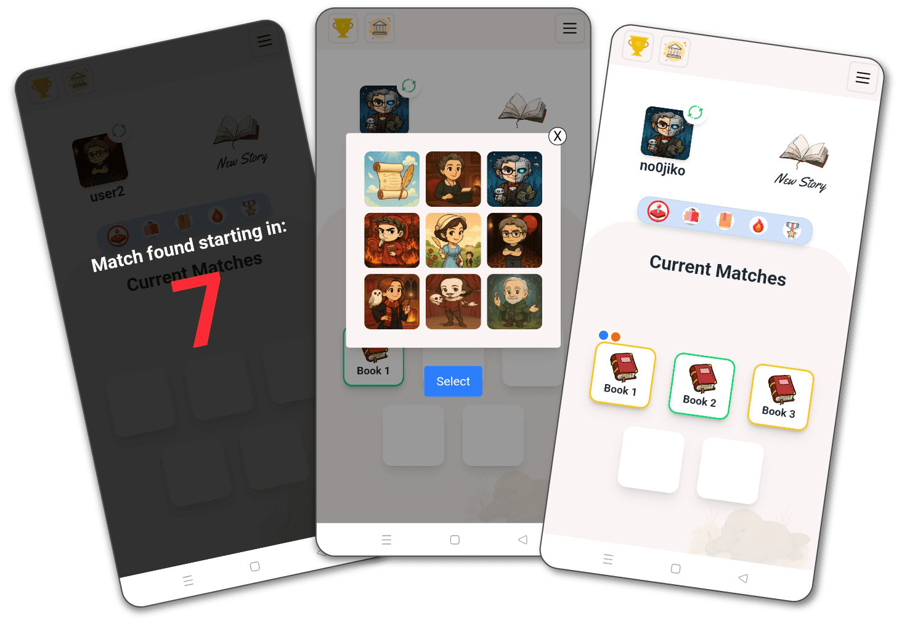

# Wordrops

**Wordrops is a real-time collaborative and competitive writing platform that lets users create stories together, earn points through gameplay, climb global leaderboards, and engage with a vibrant community of writers. It’s designed as a scalable web service accessible anywhere.**

### Author

**Samuele Sala** — Software & Web Developer  
Founder and sole developer of Wordrops  
🔗 [LinkedIn](https://www.linkedin.com/in/samuele-sala-a1a63722a/)

## Live Site

🔗 Try it live: [https://wordrops.com](https://wordrops.com)

---

### 🎥 Preview

_A full demo video is coming soon._

## TL;DR Wordrops – Technical Overview

### Real-time full-stack app, designed and built from scratch

-   **Backend:** Node.js (Express), PostgreSQL, WebSocket, OpenAI API, OAuth, JWT

-   **Frontend:** HTML + Tailwind + JavaScript (responsive UI)

-   **Real-time multiplayer** system with dynamic matchmaking (**O(1) queues**)

-   **AI integration** for titles, covers, genres, scoring, and generated images

-   **Advanced security:** Argon2, OAuth, JWT with refresh tokens

-   Live notifications via **WebSocket** + fallback database system

-   Full deployment on **Railway** + **Cloudinary**

## 📦 1. Features

### ⚔️ Game Mechanics

-   Ranked and classic game modes (short/long)
-   Turn-based multiplayer matches
-   Real-time countdown per turn
-   Match history and story progression
-   Automatic match ending + AI post-processing

### 👥 User System

-   Signup + Onboarding with avatar and username
-   User stats: games played, score, best performances, and much more
-   Public user profiles with written stories
-   Community leaderboard

### 🧭 Dashboard

-   Ongoing games section with status indicators
-   Completed games section
-   Live popup notifications for game events
-   Unread message / new chapter indicators
-   Quick access to rejoin games in progress

### 🧠 AI Features

-   AI-generated story titles
-   AI-generated back covers
-   AI-generated genres and tags
-   AI-generated custom cover images
-   AI-generated scoring for ranked matches

### 💬 Communication

-   In-game real-time chat between players

### 📚 Community

-   Public stories page: browse and read any story
-   Story detail view with chapters, authors, ratings
-   Following authors and favorite stories (coming soon)
-   Public user profiles linked from stories and rankings

### 🔔 Notification System

-   Live dashboard popups for:
    -   new chapters
    -   game endings
    -   unread messages
-   Notification dots per ongoing game

### 🛡️ Security & Auth

-   JWT-based session management
-   OAuth login integration
-   Passwords hashed with Argon2

## ⚙️ 2. Tech Stack

### Frontend

-   HTML, EJS (server-side rendering for SEO pages)
-   TailwindCSS
-   Vanilla JavaScript

### Backend

-   Node.js
-   Express
-   WebSocket (Socket.io)
-   Cloudinary (media storage)

### Database

-   PostgreSQL

### Authentication & Security

-   JWT (JSON Web Tokens)
-   OAuth
-   Argon2 (password hashing)

### AI Integration

-   OpenAI API

## 3. Architecture Overview

The overall architecture of the platform is designed to ensure smooth communication between the client, backend, database, AI services, and external authentication.

The **client** (web app) interacts with the **backend** via REST API for standard requests and WebSocket (Socket.io) for real-time game updates and notifications. The backend handles game logic, user authentication (using JWT and OAuth), database operations (PostgreSQL), AI integration (OpenAI API), and media storage (Cloudinary).

The backend communicates with:

-   The **database** for storing and retrieving user data, game state, stories, scores and much more.
-   The **OpenAI API** to generate story content, scores, and cover images.
-   The **OAuth provider** to manage third-party login flows.
-   **Cloudinary** for storing AI-generated images.

This interaction flow ensures real-time responsiveness and dynamic content generation while maintaining data integrity and security.

## 4. AI Integration

AI is used to automate content generation and scoring based on the chapters written by users during a match. This allows the platform to deliver fully-formed stories and rankings without slowing down the user experience.

✍️ **Post-Match Story Processing (all matches)**  
After a game ends (ranked or not), the backend sends the chapters to the OpenAI API to generate:

-   Title based on the full story
-   Backcover description
-   Detected genres (used for classification and filters)
-   Prompt for cover image generation
-   Cover image, created with gpt-image-1 and stored in Cloudinary

This content is used throughout the whole platform.

🏆 **Ranked Game Evaluation (only for ranked matches)**  
If the match was ranked, additional evaluation is triggered:

-   Each chapter is individually analyzed and compared to the others by the AI
-   A score is generated for each contribution
-   A short comment is returned, used as feedback for the player

📸 Example — live AI-generated score and feedback after a ranked match:

📄 [textGeneratorAi.js](./src/utils/textGeneratorAi.js) – Manages title, back cover, genres, image prompts, and scoring logic using OpenAI.

## 5. Real-time Multiplayer

The matchmaking logic is handled server-side with custom queue management.  
**Socket.io** is used only once a match is created, to enable real-time communication between the server and connected players.

### 🎯 Queue O(1)

Queues are implemented using a simple `Queue` class with `head` and `tail` pointers. This ensures:

-   **O(1)** insertion (`enqueue`)
-   **O(1)** batch removal of 5 players (`dequeueMultiples`)
-   Player removal by ID (`removePlayer`) is currently **O(n)**
    > 📌 Aware that this could be optimized further with a doubly linked list + hashmap for full O(1) operations, but until the user base stays low there's no need to add unnecessary complexity.

### ⚙️ Dynamic group/game creation

Each time a player joins a queue (e.g., `ranked.fast`, `normal.slow`), the server immediately checks its size.  
When it reaches 5 players, they're removed and grouped into a new game instance.

> The `gameQueues` object keeps track of all active queues.

### 🔌 WebSocket (Socket.io)

**Socket.io** is used to manage real-time communication **after a match is created**.

Key events:

-   `game-ready`: triggered when 5 players are matched
-   `countdown`: synchronized countdown before the game starts
-   `game-start`: signals the official start of the game
-   `gameCanceled`: triggered when two players fail to write a chapter, causing the match to be canceled
-   `queueAbandoned`: triggered when **you** abandon the queue before a game starts

### 📸 Demo

## 6. Authentication & Security

This project uses standard practices for user authentication and security:

-   **JWT (JSON Web Token)**:  
    Implements stateless authentication using both **access tokens** and **refresh tokens**.  
    Access tokens authorize requests to protected endpoints and have a short lifespan, while refresh tokens enable seamless token renewal without forcing re-login.  
    Both tokens are securely signed and verified on the server.

-   **OAuth Integration**:  
    Allows login via third-party providers (e.g., Google) to simplify onboarding and improve security.

-   **Password hashing**:  
    User passwords are hashed with **argon2** before storing in the database, protecting credentials even if data leaks.

-   **Session protection**:  
    Sessions use secure cookies with **HTTPOnly** and **Secure** flags to mitigate XSS and session hijacking attacks.

## 7. Database

The database is designed to support the multiplayer game logic, user management, and social interactions (comments, notifications, statistics).

### Overall structure:

-   **Users**: stores user data and credentials.
-   **Games_completed**: contains information about completed matches (game type, status, cover images, etc.).
-   **Game_players**: links users to games, managing player participation.
-   **Games_chapters**: stores chapters written by players during matches, including score, author, and turn information.
-   **Game_genres & Genres**: categorize games by genre.
-   **Notifications**: backup system for notifications related to scores and results (mainly handled in memory and synced with the database).
-   **User_statistics**: aggregated stats for each user.
-   **Story_comments** (in development): system for comments on published stories.

### Key relationships:

-   Each chapter (`Games_chapters`) is linked to a specific game and author.
-   Notifications are associated with users but primarily managed in-memory for performance reasons.
-   User statistics are aggregated to track user progress over time.
-   Game-to-genre associations are managed through the `Game_genres` and `Genres` tables.

## 🔔 8. Notification System

When a ranked game ends, each player receives a score and a short AI-generated comment for their chapter contribution. These notifications are:

-   Stored in the database for persistence
-   Cached in memory using a `NotificationMap` for fast access
-   Synced in real time between client and server

The full notification flow includes caching, read-state handling, server crash recovery, and performance considerations.

📄 [Full Technical Breakdown – Scores Notification System](./docs/notifications.md)

## Known Limitations / Next Steps

-   **MPA with vanilla JS**  
    The project is still a classic Multi-Page App without heavy frameworks like React or Next.js. This keeps things lightweight and simple, but with a multiplayer system and real-time notifications, it gets tricky to handle everything smoothly since every page reload resets connections.

-   **Leaving the page kicks you out of the queue**  
    If a user joins a game queue and then leaves the page, they get removed from the queue. It works, but it’s not ideal — imagine wanting to browse or read stories while waiting for the game to start. This definitely needs a refactor to make the experience smoother and less restrictive.

-   **Dependency on external AI models**  
    Wordrops relies on third-party AI models, which can change frequently (APIs and pricing). This is something to watch because it can affect costs and stability. Ideally, the AI integration should be modular enough to swap models without major rewrites.

-   **No TypeScript or automated tests yet**  
    To keep the code manageable and avoid panic during refactors, the next step is to start adding TypeScript, at least for the critical parts. Also, begin writing automated tests (like with Jest) so bugs don’t just pop up at runtime.

---

These are the main things I know need improving to make Wordrops more stable and user-friendly going forward.
