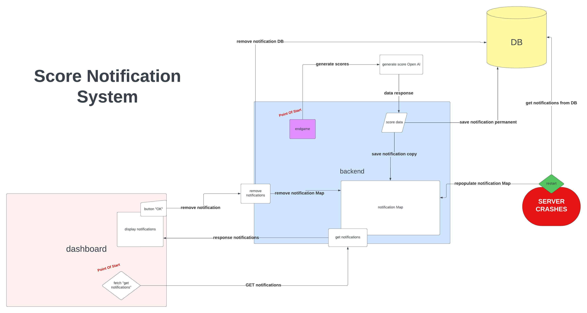

# 🧠 Scores Notification System

There are many ways to set up a notification system, and mine may not be the most optimal, especially since I’m not using any pre-built solutions. However, here's how I approached it.

Whenever a ranked game ends, we make a call to OpenAI to generate scores and a brief comment for each chapter in the game’s story.

Once the data is received and all game-related information has been stored in the database, we proceed with two actions:

1. **Save notifications**: A notification is created for each player (game ID, score, comment) and saved in the database.
2. **Cache notifications**: The same data is stored in an in-memory `NotificationMap` for quick access.

---

## 🔁 Notification Flow

The primary entry point for checking notifications is the dashboard. Queries to the database occur only in the following situations:

-   **After a game ends**: To save the permanent game data.
-   **When a notification is read**: The data is then removed from both the `NotificationMap` and the database.

This setup avoids unnecessary database calls. The initial notification fetch happens once when the user logs in or refreshes the page. After that, the in-memory `NotificationMap` is used, synchronized with the DB in real time.

---

## 📋 System Summary

1. **Game Ends**  
   → Save to DB and store in `NotificationMap`

2. **User Checks Notifications**  
   → Serve from `NotificationMap`

3. **User Reads Notification**  
   → Remove from both cache and DB

---

## 🔧 Server Recovery

If the server crashes or restarts, the system auto-loads all current notifications from the database into the `NotificationMap`. This ensures no data loss and a seamless user experience.

---

## 🧪 Potential Improvement: Delayed Notification Removal

Instead of deleting notifications immediately after they're marked as read, the system could:

-   Mark them as "read" with an `is_read` flag
-   Perform **bulk deletion** every 24h

### ✅ Why this matters

-   **UPDATE vs DELETE**: Updates are less costly. Fewer DELETE ops = better real-time DB performance
-   **Bulk cleanup**: Efficient and avoids race conditions
-   **Crash recovery**: Persisted "read" flags prevent orphaned or duplicate notifications after a crash

---

## ✅ Benefits

-   **Performance**: Lighter DB operations
-   **Reliability**: Safer recovery strategy
-   **Scalability**: Easier to manage as user base grows
